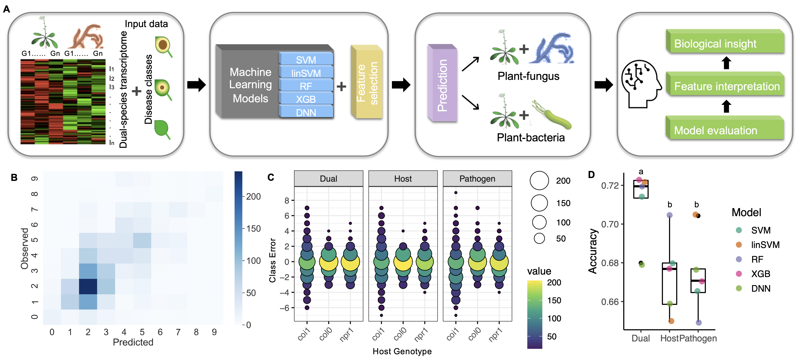

# Machine learning general transcriptional predictors of plant disease

This is a machine learning project to predict lesion size from initial RNA-seq of the Arabidopsis-Botrytis.

Plants utilize an innate immune system to defend against all classes of microbial invaders. While we understand specific genetic determinants of host-pathogen interactions, it remains less clear how generalized the immune response is to diverse pathogens. Using a data-driven approach, and utilizing feature selection based on network science and topology, we developed machine learning models that could predict host disease development across diverse pathosystems. This indicates that the models identified early transcriptional responses predictive of later disease development, regardless of pathogen class, using a fraction of the host transcriptome. The identified genes sets were not enriched for canonical defense genes, but where statistically enriched for genes previously identified from independent data sets, including those described as representing a general plant stress response. These results highlight novel components of a general plant immune response, and demonstrate the application of machine learning to address biological hypotheses of a complex multigenic outcome. 

## Organization
1. Machine learning methods performance comparison
2. Feature selection and comparison with domain-knowledge gene lists.

## Data
### Arabidopsis Thaliana - Botrytis TPM data
The _Arabidopsis thaliana_ and _Botrytis cinerea_ Lesion and TPM data can be found [here](https://drive.google.com/file/d/1HWlEMhWJRKitKALu1gOIlI5YyM1W6gis/view?usp=share_link)
